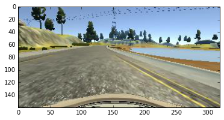
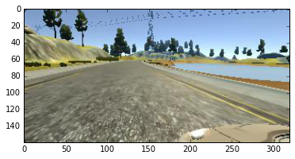
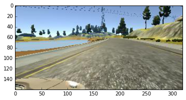
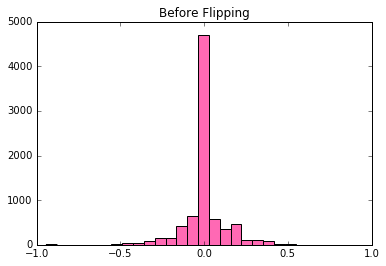
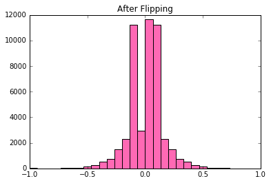
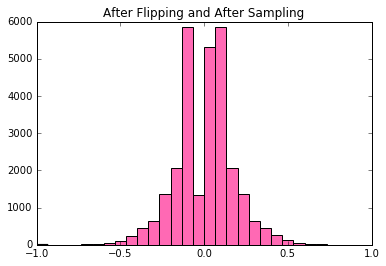

# CarND-Behavioral-Cloning-P3

Here is a brief breakdown of what's contained in this repository. 

`README.md`  
`drive.py`  
`model.h5`: weights	 
`model.json`: model  
`model.py`: how my model is trained	 
`preprocessing.py`: how train/test examples are created  
`preprocessing_additional.py`: how additional train/test are created and merged to old  
`sandbox.py`: additional code experimented by didn't make into the final model  

### Model Architecture  

My final model makes use of convolutional neural networks with four convolutional layers followed by two fully connected layers. It evolved from the [steering angle model](https://github.com/commaai/research/blob/master/train_steering_model.py) built by comma.ai. However, it has its own strengths that the other model lacks.  

As I learned from my [Project 2: Traffic Sign Classification](https://github.com/anguillanneuf/CarND-Traffic-Sign-Classifier-Project), inserting a 1x1 convolution right in the beginning allows my neural network to learn its own color space. This elimiates the need for me to convert the original color space from RGB to a number of possible color spaces out there such as HSV, YUV, etc. I keep the number of filters at this stage to be the same as the input image.  

Following the `3 1x1` are `16 5x5` with a stride of `4`, `32 3x3` with a stride of `2`, `64 3x3` with a stride of `2`. Because maxpooling is not used, the only other way for me to reduce the size of my layer is by taking strides. I keep the Exponential Linear Unit (ELU) layers used by comma.ai while adding a batch normalization layer before each of the nonlinearities. From my own testing, batch normalization was extremely effective and powerful, and *I think that the reason is batch normalization improves gradient flow by normalizing the logits into a nice Gaussian distribution right before they must survive or perish in the ELU layer. This ensures that there are fewer dead neurons in the neural network which are killed by absent gradient flow.*   

From my experience with Project 2, He normal weights worked very well, that's probably the only reason why I switch out the default `'glorot_uniform'` weights initialization to `'he_normal'`. I know from [Standard's CS231n Lecture 5 Slide 69/102](http://cs231n.stanford.edu/slides/winter1516_lecture5.pdf) that batch norm reduces a deep neural net's strong dependence on correct weights initialization. The last fully connected layers following the convolutional layers are straightfoward. Batch normalization is used in those layers as well.  

Lastly, dropout layers are employed for the fully connected layers with a drop rate of `0.2` and `0.5` respectively. They are there to prevent overfitting of the model. They are inherited from comma.ai. 

### Training Strategy  

When I was using exactly the same architecture as described above but **without** batch normalization, I was able to train the car to **almost** go around the track. It had one trouble spot though. It was sliding very harshly against the wall on the bridge, which wouldn't be fun for passengers sitting in the car. At first, I tried to collect more data for that particular trouble spot and fine-tune the weights that had already been working quite well except for that spot. However, because my architecture wasn't complex enough, anything that I collected and blended with the original training examples threw my model off. If the car passed the bridge, it swerved off the road at the next sharp left turn; if the car made it through the next sharp left turn, it drove off into the lake in the next right turn. 

Eventually I stopped and questioned my model architecture, because it clearly unlearned some good turns that it had been making earlier. I added batch normalization next, hoping that some neurons wouldn't freeze or die from further training. Once it got added, even the models that had been trained without it began to show improvement with additional epochs that contain additional training data collected by myself. That was great!

I ususally trained for `8` to `10` epochs at first; with additional self-collected data, I continued to train `2` to `3` epochs at a time to improve the model some more.  

### Preprocessing Strategy

Interestingly, I did not do as much preprocessing as some had suggested since there is quite some discussion on Slack and in the forum, especially on image augmentation. 

I made use of center/left/right images. Through trial and error, I found the best offset angle for the left and right images for me was not `0.25` but `0.08`, which correspondes to a `2°` turn in the simulator. Offset angles means how much I add or substract from the original steering angle for the provided left/right images. Here is an example `IMG/center_2016_12_01_13_39_27_924.jpg`. 

Original: -0.933238  
  
Left: -0.933238+0.08  
  
Flipped Left: -(-0.933238+0.08)  

In addition, I made use of `height_shift_range` in keras's `ImageDataGenerator` and set it to `0.2`. In my reasoning, shifting the image along the vertical axis works the same as cropping out the car hood on the bottom or the blue sky on the top of the image, even though cropping could create more precise data for the network to learn. I would still prefer my method over cropping because if the road for some reason is uneven and makes the car bounce up and down quite a lot, the front camera video feed will change, and my model, which is trained on height-shifted images, will still knows how to steer. 

In terms of making the data more balanced, because the original data contains a lot of zero steering angles, I created a threshold using my angle offset `0.08`, and sampled half of the examples that fall within that range. Here is what my entire datasets look like before they get split into train and test. 

  

  

### Final Model and its Training Data

For my final model, I used only the Udacity data without anything that I collected myself. I have `43,394` training examples and `4,822` testing examples. They add up exactly to `8036*3*2 = 48,216`. I trained for `10` epochs with batch size `128`. My validation loss decreased all the way to `0.013` for this particular model, higher than some other models trained using both Udacity and self-collected data, which were also able to drive the car around in the simulator.   
